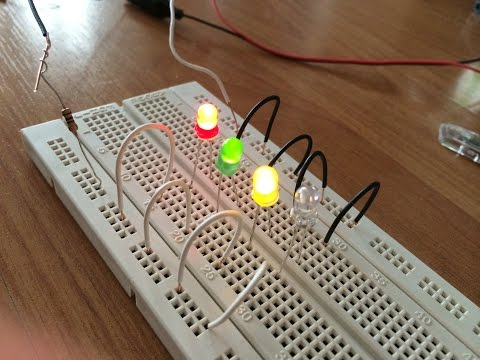

# 🧪 Basic Instrumentation & LED Forward Voltage Characterization

## 📝 Project Description
This was an introductory hands-on project focused on getting comfortable with **electrical lab instrumentation**. I used a Keysight oscilloscope, a digital multimeter, and a DC power supply to characterize the forward voltage and current of different colored LEDs (red, green, and blue).

The goal was to build confidence with instruments, understand how to make precise measurements, and observe how **forward voltage depends on LED color**.

---

## ⚡ Circuit Details
- **Components:** 3 LEDs (Red, Green, Blue), 1 kΩ and 10 kΩ resistors  
- **Power Supply:** 10 V DC  
- **Measurement:** Voltage across LED, current through resistor (calculated via Ohm’s Law)

---

## 🧰 Tools & Equipment
- Keysight DC Power Supply  
- Digital Multimeter (DMM)  
- Oscilloscope (Keysight)  
- Breadboard and jumper wires


---

## 📊 Measurements

| LED Color | Voltage (V) | Current (mA) |
|-----------|------------|--------------|
| Red       | 1.88 V     | 3.14 mA      |
| Green     | 2.45 V     | 2.57 mA      |
| Blue      | 2.64 V     | 2.36 mA      |

The **blue LED** required the highest forward voltage to conduct, consistent with its higher bandgap energy.

---

## 🧠 Key Learnings
- How to safely set up and use lab instruments.  
- Measuring voltage and current accurately.  
- Relationship between LED color (bandgap energy) and forward voltage.  
- How resistor selection affects current flow.  
- Importance of proper wiring and grounding.

---

## 📂 Repository Structure
```
LED-Characterization/
│
├─ README.md
├─ Images/
│   └─ breadboard_led.jpg
├─ Data/
│   └─ led_measurements.xlsx
└─ Report/
    └─ Lab1 - Lab Instruments.pdf
```

✅ This project highlights foundational skills in **hardware measurement** and **instrument control**, which are essential for more advanced circuit design and validation work.
